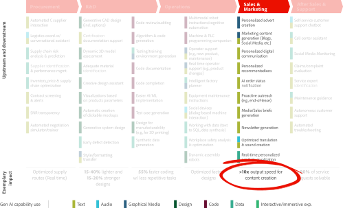
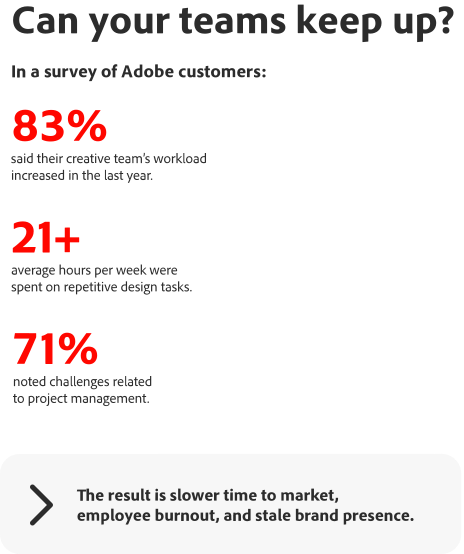
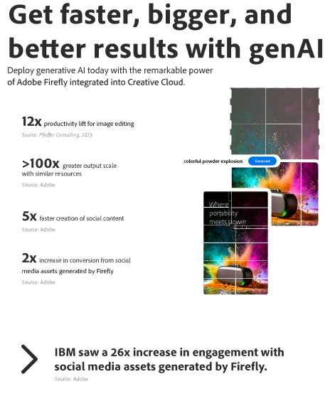
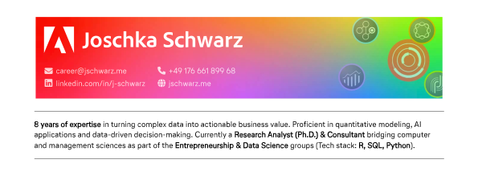
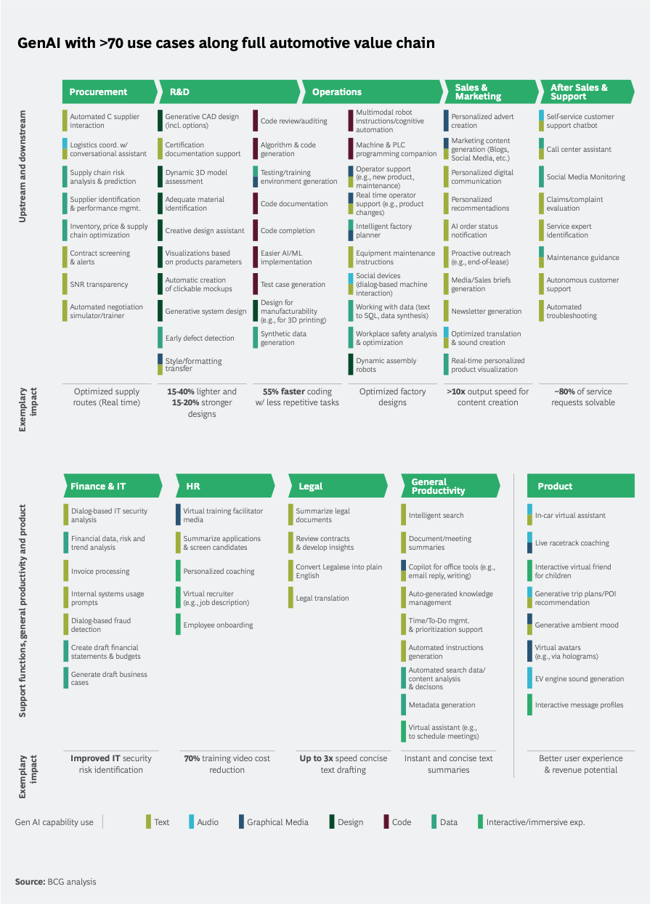

---
# TITLE & AUTHOR
title: "Explore new ways to create"
subtitle: "Generate images, audio, and now — video"
author: "Joschka Schwarz"
institute: "Sr. Solution Consultant Digital Media (candidate)"
date: today
date-format: "dddd, D. MMMM YYYY"
# FORMAT OPTIONS
footer: "Joschka Schwarz - Explore new ways to create"
---

# Demand Genai ... {data-stack-name="Intro"}

## GenAl with >70 use cases along full automotive value chain

::: {.fragment .fade-out fragment-index=1}

{.absolute width=80% left=10% top=15%}

:::

::: {.fragment .fade-in fragment-index=1}

{.absolute width=80% left=10% top=15%}

:::


## Transform content creation with generative AI

```{=html}
<div class="no-height">&nbsp;</div>
```

:::: {layout="[[1,1], [1]]"}

::: {.layout-left .canvas}
{fig-align="center"}
:::

::: {.layout-right style="background: linear-gradient(130deg, rgba(255,255,255,0.6), transparent); border-radius: 20px; border: solid 2px #fff; text-align: center; padding: 1em 0 1em 0"}
<video playsinline="" autoplay="" muted="" loop="" data-video-source="https://www.adobe.com/creativecloud/media_1064405fb991b77d7d8d46838414ea2cb82f6dc26.mp4">
<source src="https://www.adobe.com/creativecloud/media_1064405fb991b77d7d8d46838414ea2cb82f6dc26.mp4" type="video/mp4" />
Your browser does not support the video tag.
</video>
:::

::: {.canvas}
{width=75% fig-align="center"}
:::
::::

## Can your teams keep up?

```{=html}
<div class="no-height">&nbsp;</div>
```

:::: {layout="[[1], [1,1]]"}

::: {.layout-left .canvas}
Survey Questions
:::

::: {.layout-left .canvas}
{fig-align="center"}
:::

::: {.layout-left .canvas}
{fig-align="center"}
:::

::::


## How GenAI Is Shaping the Future of Creativity in Marketing

```{=html}
<div class="no-height">&nbsp;</div>
```

:::: {.columns}

::: {.column width="50%" style="text-align: left;"}
::: {style="background: linear-gradient(130deg, rgba(255,255,255,0.6), transparent); border-radius: 20px; border: solid 2px #fff; text-align: center;"}
{width=85%}
:::
:::

::: {.column .fragment width="50%" style="text-align: center;"}
::: {style="background: linear-gradient(130deg, rgba(255,255,255,0.6), transparent); border-radius: 20px; border: solid 2px #fff; text-align: center;"}
{width=85%}
:::
:::
::::

# Example {data-stack-name="Example"}

## Page 3 - Example

{.no-figure fig-align="center" style="filter: drop-shadow(5px 5px 5px #222); -webkit-filter: drop-shadow(5px 5px 5px #222);"}

:::: {.fragment .fade-in-then-out fragment-index=1}
::: {.absolute top="4.54em" right="-33%"}

{width=27.5%}
:::
::::

:::: {.fragment .fade-in-then-out fragment-index=2}
::: {.absolute top="4.54em" right="-25%"}

{width=20%}
:::
::::

:::: {.fragment .fade-in-then-out fragment-index=3}
::: {.absolute top="4.54em" right="-25%"}

{width=20%}
:::
::::

:::: {.columns}
::: {.column width="33.3%"}

:::: {.fragment fragment-index=1}

<div class="cell">
<div class="sourceCode cell-code" id="cb1"><pre class="sourceCode numberSource r number-lines code-with-copy"><code class="sourceCode r" style="text-wrap: wrap;"><span id="cb1-1"><a></a><span class="co"># 1st Prompt:</span></span>
<span id="cb1-2"><a></a><span class="fu">&gt; Generate casual coding style</span></span></code><button title="Copy to Clipboard" class="code-copy-button"><i class="bi"></i></button></pre></div>
</div>

::::


:::
::: {.column width="33.3%"}

:::: {.fragment fragment-index=2}

<div class="cell">
<div class="sourceCode cell-code" id="cb1"><pre class="sourceCode numberSource r number-lines code-with-copy"><code class="sourceCode r" style="text-wrap: wrap;"><span id="cb1-1"><a></a><span class="co"># 2nd Prompt:</span></span>
<span id="cb1-2"><a></a><span class="fu">&gt; Generate business style</span></span></code><button title="Copy to Clipboard" class="code-copy-button"><i class="bi"></i></button></pre></div>
</div>

::::

:::
::: {.column width="33.3%"}

:::: {.fragment fragment-index=3}

<div class="cell">
<div class="sourceCode cell-code" id="cb1"><pre class="sourceCode numberSource r number-lines code-with-copy"><code class="sourceCode r" style="text-wrap: wrap;"><span id="cb1-1"><a></a><span class="co"># 3rd Prompt:</span></span>
<span id="cb1-2"><a></a><span class="fu">&gt; Make it more CEO-like</span></span></code><button title="Copy to Clipboard" class="code-copy-button"><i class="bi"></i></button></pre></div>
</div>

::::

:::
::::

# Ways of genAI {data-stack-name="genAI"}

## Explore new ways to create (1/2)

```{=html}
<div class="no-height">&nbsp;</div>
```

:::: {layout="[[1,1], [1,1]]"}

::: {.canvas2 .flex-66}

<span class="text-1">TEXT AND IMAGE TO VIDEO</span>

<span class="text-2">Video workflows, reinvented.</span>

<span class="text-3">Pick two still images and use them as keyframes to generate a video. Or put your idea into motion with a text prompt. Generate b-roll, create visual effects, and refine shots by choosing camera angles, motion, and style.</span>

:::

::: {style="background: linear-gradient(130deg, rgba(255,255,255,0.6), transparent); border-radius: 20px; border: solid 2px #fff; text-align: center; padding: 1em 0 1em 0"}
<video playsinline="" autoplay="" muted="" loop="" data-video-source="https://www.adobe.com/creativecloud/media_18a36150a537ca6d1cfbc19e4bb77ef7db26599d5.mp4">
<source src="https://www.adobe.com/creativecloud/media_18a36150a537ca6d1cfbc19e4bb77ef7db26599d5.mp4" type="video/mp4" />
Your browser does not support the video tag.
</video>
:::

::: {.flex-45 .shadow}

:::

::: {.canvas2 .flex-66}
<span class="text-1">AUDIO AND VIDEO TRANSLATION</span>

<span class="text-2">Go global. Sound local.</span>

<span class="text-3">Make anyone sound like a native speaker by maintaining the same voice, tone, and cadence across multiple languages.</span>
:::

::::

## Explore new ways to create (2/2)

```{=html}
<div class="no-height">&nbsp;</div>
```

:::: {layout="[[1,1], [1,1]], [1,1]]"}

::: {.canvas2 .flex-66}

<span class="text-1">STYLE AND STRUCTURE REFERENCE</span>

<span class="text-2">Create with more precision.</span>

<span class="text-3">Get the right look in less time, even without the perfect prompt. Mimic layouts, poses, and styles. Adjust and refine, or try a new reference image to explore more creative options.</span>

:::

::: {.flex-45 .layout-center .shadow}

:::

::: {.flex-45 .layout-center .shadow}

:::

::: {.canvas2 .flex-66}
<span class="text-1">SCENE TO IMAGE</span>

<span class="text-2">Put your images into perspective.</span>

<span class="text-3">Design dimensional brand graphics, packaging, illustrations, and more in an intuitive 3D workspace. Create accurate spatial relationships, change angles, and adjust lighting fast — no redrawing needed.</span>
:::

::: {.canvas2 .flex-66}

<span class="text-1">CUSTOM MODELS</span>

<span class="text-2">Train on your own brand assets with Custom Models.</span>

<span class="text-3">Drive on-brand content creation across your organization with custom models integrated into your Adobe solutions, unleashing your teams’ creativity while consistently maintaining your unique look and feel.</span>

:::

::: {.flex-45 .layout-center .shadow}

:::

::::

# Production {data-stack-name="Prod"}

## Streamline production of asset variants for faster, personalized marketing (1/2)

```{=html}
<div class="no-height">&nbsp;</div>
```

:::: {layout="[[1,1], [1,1]]"}

::: {.flex-45 .layout-center .shadow}

:::

::: {.canvas2 .flex-66}

<span class="text-1">Campaign refreshes</span>

<span class="text-2">Accelerate campaign refreshes by streamlining repetitive tasks.</span>

<p class="text-3">Quickly produce mass quantities of asset variants and keep marketing up to date — without overburdening your creative team.</p>
<ul class="text-3">
<li>Easily resize assets for any channel or platform.</li>
<li>Quickly update seasonal campaigns with Firefly-generated imagery.</li>
<li>Scale on-brand content quickly with <a href="/products/firefly-business/custom-models.html" daa-ll="Custom Model APIs-1--Accelerate campaign ">Custom Model APIs</a>.</li>
</ul>

:::

::: {.canvas2-margin .flex-66 style="margin-top: 1em;"}

<span class="text-1">Content localization</span>

<span class="text-2">Localize assets and videos to increase marketing reach.</span>

<p class="text-3">Go global with fast, easy-to-use localization that scales.</p>
<ul class="text-3">
<li>Save time and effort using AI-generated location backgrounds instead of creating local variants from scratch.</li>
<li>Streamline content assembly workflows by automating time-consuming, repetitive tasks.</li>
<li>Reduce production costs with Translate and Lip Sync APIs to convert videos into multiple languages.</li>
</ul>

:::

::: {.flex-45 .shadow .layout-center}

:::

::::


## Streamline production of asset variants for faster, personalized marketing (2/2)

```{=html}
<div class="no-height">&nbsp;</div>
```

:::: {layout="[[1,1], [1,1]]"}

::: {.flex-45 .layout-center .canvas3}

:::

::: {.canvas2 .flex-66}

<span class="text-1">Content personalization</span>

<span class="text-2">Personalize assets and videos to connect with customers.</span>

<p class="text-3">Create unlimited asset variations that tailor your content to diverse audience segments—breaking past resource limits so you can captivate like never before.</p>
<ul class="text-3">
<li>Generate Firefly assets variations without overwhelming your creative teams.</li>
<li>Incorporate segment- specific messages with relevant images into Photoshop templates to personalize ads at scale.</li>
<li>Generate and test more assets to enhance campaign performance.</li>
</ul>

:::

::: {.canvas2-margin .flex-66}

<span class="text-1">AI-driven experiences</span>

<span class="text-2">Create unique user experiences to wow customers.</span>

<p class="text-3">Encourage brand interaction through personalized content, powered by AI.</p>
<ul class="text-3">
<li>Increase engagement by building individual, customized experiences.</li>
<li>Keep content on-brand in every interaction with Custom Models APIs.</li>
<li>Enhance customer satisfaction and build greater brand loyalty.</li>
</ul>

:::

::: {.flex-45 .layout-center .canvas4}

:::

::::


# Use Cases {data-stack-name="Usecases"}


## Heading 2

```{=html}
<div><p>&nbsp;</p></div>
```

::: {style="background: linear-gradient(130deg, rgba(255,255,255,0.6), transparent); border-radius: 20px; border: solid 2px #fff; text-align: center;"}
{width=20%}
:::


# Results {data-stack-name="Results"}

## How GenAI Is Shaping the Future of Creativity in Marketing

::: {.panel-tabset}

### <span slot="icon"><svg width="20" height="20" viewBox="0 0 20 20" fill="currentColor" xmlns="http://www.w3.org/2000/svg"><path d="M18.0137 2.3887C17.3965 1.97073 16.6172 1.88479 15.9238 2.16018C12.9639 3.33791 10.7129 4.01272 9.75 4.01272H5C2.79395 4.01272 1 5.80569 1 8.00979C1 10.2129 2.79395 12.0059 5 12.0059H5.1626L7.42383 17.458C7.82227 18.419 8.75488 19 9.73535 19C10.0537 19 10.377 18.9385 10.6895 18.8096C11.3057 18.5537 11.7861 18.0742 12.042 17.458C12.2979 16.8408 12.2979 16.1621 12.042 15.543L10.6204 12.1174C11.7852 12.3518 13.6384 12.9553 15.9326 13.8565C16.1982 13.9609 16.4766 14.0117 16.7539 14.0117C17.1982 14.0117 17.6387 13.8799 18.0166 13.6221C18.6328 13.2031 19 12.5078 19 11.7627V4.25098C19 3.50391 18.6309 2.80764 18.0137 2.3887ZM2.5 8.0098C2.5 6.63285 3.62109 5.51273 5 5.51273H9V10.5059H5C3.62109 10.5059 2.5 9.38577 2.5 8.0098ZM10.6572 16.8828C10.5547 17.1289 10.3623 17.3213 10.1152 17.4239C9.60743 17.6348 9.02149 17.3926 8.8086 16.8838L6.78565 12.0059H8.95081L10.6572 16.1192C10.7588 16.3653 10.7588 16.6368 10.6572 16.8828ZM17.5 11.7627C17.5 12.0147 17.3809 12.2412 17.1728 12.3828C16.9648 12.5235 16.7119 12.5508 16.4814 12.46C13.7757 11.397 11.7788 10.7713 10.5 10.5774V5.44291C11.7939 5.25102 13.7904 4.62284 16.4785 3.55473C16.7119 3.46196 16.9648 3.4893 17.1709 3.62993C17.3799 3.77153 17.5 3.99809 17.5 4.25102L17.5 11.7627Z" fill="currentColor"></path></svg></span><span slot="label"> Featured</span>

:::: {layout="[[1,1,1], [1,1,1]]" height=50%}

{height=200 width=250 fig-align="center"}

{height=200 width=250 fig-align="center"}

{height=200 width=250fig-align="center"}

{width=75% fig-align="center"}

{width=75% fig-align="center"}

{width=75% fig-align="center"}

::::

### <span slot="icon"><svg xmlns="http://www.w3.org/2000/svg" width="20" height="20" viewBox="0 0 20 20" fill="currentColor"><path data-name="Path 1005062" d="m14.5,7.52114c0,.82843-.67157,1.5-1.5,1.5-.82843,0-1.5-.67157-1.5-1.5,0-.82843.67157-1.5,1.5-1.5s1.5.67157,1.5,1.5h0" fill="currentColor"></path><path d="m16.75,3H3.25c-1.24023,0-2.25,1.00977-2.25,2.25v9.5c0,1.24023,1.00977,2.25,2.25,2.25h13.5c1.24023,0,2.25-1.00977,2.25-2.25V5.25c0-1.24023-1.00977-2.25-2.25-2.25Zm-13.5,1.5h13.5c.41309,0,.75.33691.75.75v8.21094l-1.90918-1.90918c-.87695-.87695-2.30469-.87695-3.18164,0l-1.23145,1.23145c-.09961.09766-.25684.09668-.35449.00098l-3.23242-3.23242c-.84961-.84961-2.33203-.84961-3.18164,0l-1.90918,1.90918v-6.21094c0-.41309.33691-.75.75-.75Zm0,11c-.41309,0-.75-.33691-.75-.75v-1.16797l2.96973-2.96973c.29297-.29297.76758-.29297,1.06055,0l3.2334,3.2334c.68164.67969,1.79199.68066,2.47363-.00098l1.23242-1.23242c.29297-.29297.76758-.29297,1.06055,0l2.70068,2.70068c-.1311.11206-.29565.18701-.48096.18701H3.25Z" fill="currentColor"></path></svg></span><span slot="label"> Image</span>

:::: {layout="[[1,1,1], [1,1,1]]"}

<div class="quarto-figure quarto-figure-center">
<figure>
<p></p>
<figcaption>Text to image</figcaption>
</figure>
</div>

<div class="quarto-figure quarto-figure-center">
<figure>
<p></p>
<figcaption>Text to image</figcaption>
</figure>
</div>

<div class="quarto-figure quarto-figure-center">
<figure>
<p></p>
<figcaption>Text to image</figcaption>
</figure>
</div>

<div class="quarto-figure quarto-figure-center">
<figure>
<p></p>
<figcaption>Text to image</figcaption>
</figure>
</div>

<div class="quarto-figure quarto-figure-center">
<figure>
<p></p>
<figcaption>Text to image</figcaption>
</figure>
</div>

<div class="quarto-figure quarto-figure-center">
<figure>
<p></p>
<figcaption>Text to image</figcaption>
</figure>
</div>

::::

### <span slot="icon"><svg width="20" height="20" viewBox="0 0 20 20" fill="currentColor" xmlns="http://www.w3.org/2000/svg"><path d="M15.75 18H4.25C3.00977 18 2 16.9902 2 15.75V4.25C2 3.00977 3.00977 2 4.25 2H15.75C16.9902 2 18 3.00977 18 4.25V15.75C18 16.9902 16.9902 18 15.75 18ZM4.25 3.5C3.83691 3.5 3.5 3.83691 3.5 4.25V15.75C3.5 16.1631 3.83691 16.5 4.25 16.5H15.75C16.1631 16.5 16.5 16.1631 16.5 15.75V4.25C16.5 3.83691 16.1631 3.5 15.75 3.5H4.25Z" fill="currentColor"></path><path d="M13.0731 9.11916L8.47336 6.64704C7.80715 6.28898 6.99994 6.77155 6.99994 7.52789V12.4721C6.99994 13.2285 7.80715 13.711 8.47336 13.353L13.0731 10.8809C13.7752 10.5035 13.7752 9.49652 13.0731 9.11916Z" fill="currentColor"></path></svg></span><span slot="label"> Video</span>

<div style="background-image: linear-gradient(176.98deg, rgba(27, 27, 27, 0) 49.88%, rgb(27, 27, 27) 97.23%), url(https://firefly.adobe.com/imgs/text-to-video.ecfbe60d.webp;); background-size: cover; background-position: center center; background-repeat: no-repeat;" class="dn9LEY4FRcvh_lEHAAYY"></div>

### <span slot="icon"><svg width="20" height="20" viewBox="0 0 20 20" fill="currentColor" xmlns="http://www.w3.org/2000/svg"><path d="M2.75 11.75C2.33594 11.75 2 11.4141 2 11V8.5C2 8.08594 2.33594 7.75 2.75 7.75C3.16406 7.75 3.5 8.08594 3.5 8.5V11C3.5 11.4141 3.16406 11.75 2.75 11.75Z" fill="currentColor"></path><path d="M16.75 12.75C16.3359 12.75 16 12.4141 16 12V7.5C16 7.08594 16.3359 6.75 16.75 6.75C17.1641 6.75 17.5 7.08594 17.5 7.5V12C17.5 12.4141 17.1641 12.75 16.75 12.75Z" fill="currentColor"></path><path d="M6.25 16.5C5.83594 16.5 5.5 16.1641 5.5 15.75V3.75C5.5 3.33594 5.83594 3 6.25 3C6.66406 3 7 3.33594 7 3.75V15.75C7 16.1641 6.66406 16.5 6.25 16.5Z" fill="currentColor"></path><path d="M9.75 14.5C9.33594 14.5 9 14.1641 9 13.75V5.75C9 5.33594 9.33594 5 9.75 5C10.1641 5 10.5 5.33594 10.5 5.75V13.75C10.5 14.1641 10.1641 14.5 9.75 14.5Z" fill="currentColor"></path><path d="M13.25 19C12.8359 19 12.5 18.6641 12.5 18.25V1.75C12.5 1.33594 12.8359 1 13.25 1C13.6641 1 14 1.33594 14 1.75V18.25C14 18.6641 13.6641 19 13.25 19Z" fill="currentColor"></path></svg></span><span slot="label"> Audio</span>

<div class="photos">
<ul>
<li><span><a href="#"></a></span>
<span>Android</span>
<a href="">See More...</a>
</li>
<li><a href="#"></a>
<span>Android</span>
<a href="">See More...</a>
</li>
<li><span><a href="#"></a></span>
<span>Android</span>
<a href="">See More...</a>
</li>
<li><a href="#"></a>
<span>Android</span>
<a href="">See More...</a>
</li>
<li><span><a href="#"></a></span>
<span>Android</span>
<a href="">See More...</a>
</li>
<li><a href="#"></a>
<span>Android</span>
<a href="">See More...</a>
</li>
</ul>
</div>
          
          
          


          
### <span slot="icon"><svg width="20" height="20" viewBox="0 0 20 20" fill="none" xmlns="http://www.w3.org/2000/svg"><path d="M17 14.2684V9.75001C17 9.33595 16.6641 9.00001 16.25 9.00001C15.8359 9.00001 15.5 9.33595 15.5 9.75001V14.2685C14.9327 14.484 14.484 14.9327 14.2685 15.5H5.73157C5.51605 14.9327 5.06732 14.484 4.5 14.2684V6.73151C5.06732 6.51599 5.51599 6.06733 5.73151 5.5H8.75C9.16406 5.5 9.5 5.16406 9.5 4.75C9.5 4.33594 9.16406 4 8.75 4H5.73157C5.42713 3.19861 4.65699 2.625 3.75 2.625C2.57812 2.625 1.625 3.57812 1.625 4.75C1.625 5.65698 2.19861 6.42706 3 6.73151V14.2685C2.19861 14.5729 1.625 15.343 1.625 16.25C1.625 17.4219 2.57812 18.375 3.75 18.375C4.65698 18.375 5.42706 17.8014 5.73151 17H14.2685C14.5729 17.8014 15.343 18.375 16.25 18.375C17.4219 18.375 18.375 17.4219 18.375 16.25C18.375 15.343 17.8014 14.5729 17 14.2684ZM3.75 3.87501C4.23242 3.87501 4.625 4.26759 4.625 4.75001C4.625 5.23243 4.23242 5.62501 3.75 5.62501C3.26758 5.62501 2.875 5.23243 2.875 4.75001C2.875 4.26759 3.26758 3.87501 3.75 3.87501ZM3.75 17.125C3.26758 17.125 2.875 16.7324 2.875 16.25C2.875 15.7676 3.26758 15.375 3.75 15.375C4.23242 15.375 4.625 15.7676 4.625 16.25C4.625 16.7324 4.23242 17.125 3.75 17.125ZM16.25 17.125C15.7676 17.125 15.375 16.7324 15.375 16.25C15.375 15.7676 15.7676 15.375 16.25 15.375C16.7324 15.375 17.125 15.7676 17.125 16.25C17.125 16.7324 16.7324 17.125 16.25 17.125Z" fill="currentColor"></path><path d="M10.2705 10.9208C10.1416 10.9208 10.0127 10.8876 9.8955 10.8202C9.61327 10.6571 9.46874 10.3309 9.5371 10.0126L9.74022 9.07311L9.09471 8.3612C8.87596 8.11901 8.83787 7.76452 9.00096 7.48229C9.16405 7.20006 9.48631 7.06041 9.80955 7.12389L10.748 7.32799L11.4599 6.68248C11.7021 6.46275 12.0556 6.42662 12.3388 6.58873C12.6211 6.75182 12.7656 7.07799 12.6973 7.39635L12.4941 8.3358L13.1396 9.04771C13.3584 9.2899 13.3965 9.64439 13.2334 9.92662C13.0703 10.2088 12.7471 10.3504 12.4248 10.285L11.4854 10.0809L10.7744 10.7264C10.6328 10.8544 10.4521 10.9208 10.2705 10.9208Z" fill="currentColor"></path><path d="M14.4379 7.6873C14.2587 7.6873 14.078 7.64091 13.9144 7.54619C13.5199 7.31816 13.3197 6.86601 13.4159 6.4207L13.8265 4.51933L12.5199 3.07841C12.2137 2.74052 12.1615 2.24833 12.3895 1.8538C12.6166 1.45927 13.0658 1.2581 13.5145 1.35526L15.4159 1.7659L16.8573 0.459257C17.1942 0.153107 17.6869 0.0998768 18.0819 0.328887C18.4764 0.556917 18.6771 1.00907 18.5804 1.45438L18.1698 3.35624L19.4759 4.79667C19.7821 5.13407 19.8348 5.62577 19.6073 6.02079C19.3793 6.41532 18.9252 6.616 18.4813 6.51981L16.5799 6.10917L15.139 7.41581C14.9413 7.59501 14.6908 7.6873 14.4379 7.6873ZM14.5829 3.12041L14.993 3.57256C15.2821 3.8919 15.4007 4.33379 15.3104 4.75518L15.181 5.35284L15.6332 4.94268C15.9515 4.65459 16.3925 4.53594 16.8158 4.6253L17.413 4.75469L17.0028 4.30254C16.7128 3.98125 16.5946 3.53887 16.6864 3.11797L16.8153 2.52227L16.3627 2.93243C16.0443 3.22149 15.6019 3.34063 15.1805 3.24981L14.5829 3.12041Z" fill="currentColor"></path></svg></span><span slot="label"> Vector</span>

<div class="container">
<div class="custom-card">
<div class="img-box"></div>
<div class="custom-content">
<h2>Card 1</h2>
<p>Lorem ipsum, dolor sit amet consectetur adipisicing elit. Architecto, hic? Magnam eum error saepe doloribus corrupti repellat quisquam alias doloremque!</p>
<a href="">Read More</a>
</div>
</div>
<div class="custom-card">
<div class="img-box"></div>
<div class="custom-content">
<h2>Card 2</h2>
<p>Lorem ipsum, dolor sit amet consectetur adipisicing elit. Architecto, hic? Magnam eum error saepe doloribus corrupti repellat quisquam alias doloremque!</p>
<a href="">Read More</a>
</div>
</div>
<div class="custom-card">
<div class="img-box"></div>
<div class="custom-content">
<h2>Card 3</h2>
<p>Lorem ipsum, dolor sit amet consectetur adipisicing elit. Architecto, hic? Magnam eum error saepe doloribus corrupti repellat quisquam alias doloremque!</p>
<a href="">Read More</a>
</div>
</div>
<div class="custom-card">
<div class="img-box"></div>
<div class="custom-content">
<h2>Card 3</h2>
<p>Lorem ipsum, dolor sit amet consectetur adipisicing elit. Architecto, hic? Magnam eum error saepe doloribus corrupti repellat quisquam alias doloremque!</p>
<a href="">Read More</a>
</div>
</div>
<div class="custom-card">
<div class="img-box"></div>
<div class="custom-content">
<h2>Card 3</h2>
<p>Lorem ipsum, dolor sit amet consectetur adipisicing elit. Architecto, hic? Magnam eum error saepe doloribus corrupti repellat quisquam alias doloremque!</p>
<a href="">Read More</a>
</div>
</div>
<div class="custom-card">
<div class="img-box"></div>
<div class="custom-content">
<h2>Card 3</h2>
<p>Lorem ipsum, dolor sit amet consectetur adipisicing elit. Architecto, hic? Magnam eum error saepe doloribus corrupti repellat quisquam alias doloremque!</p>
<a href="">Read More</a>
</div>
</div>
</div>

:::


## Heading 2

Drive scale and speed for less  by putting generative AI at the  heart of your organization’s  content workflows.