---
# TITLE & AUTHOR
title: "Explore new ways to create"
subtitle: "Deliver business results with confidence using generative AI"
author: "Joschka Schwarz"
institute: "Sr. Solution Consultant Digital Media (candidate)"
date: today
date-format: "dddd, D. MMMM YYYY"
# FORMAT OPTIONS
footer: "Joschka Schwarz - Explore new ways to create"
---

# Career Path {data-stack-name="Career"}

My introduction & questions from and to the interviewers

## The path to Adobe: Navigating career stages in the age of AI

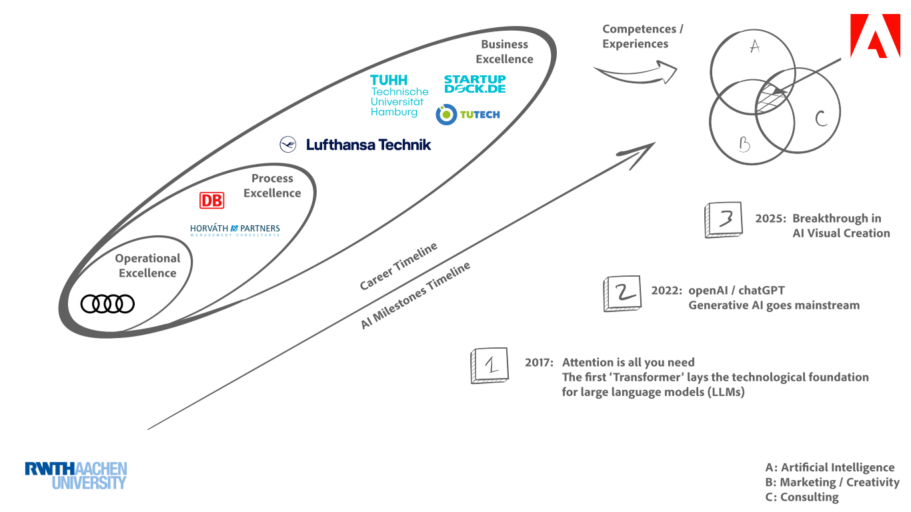{width=75% fig-align="center"}

# The power of generative AI {data-stack-name="Technology"}

... and how to leverage it for efficiency and creativity

## 3rd AI milestone: Recent Breakthrough in AI Visual Creation

:::: {.columns}

::: {.column width="50%" style="text-align: left;"}

<div class="prompt-outer shadow">
<div class="prompt">
<span>A wide image taken with a phone of a glass whiteboard, in a room overlooking the Bay Bridge. The field of view shows a woman writing, sporting a tshirt wiith a large OpenAI logo. The handwriting looks natural and a bit messy, and we see the photographer's reflection.<br><br>The text reads:<br><br>(left)<br>"Transfer between Modalities:<br><br>Suppose we directly model <br>p(text, pixels, sound) [equation]<br>with one big autoregressive transformer.<br><br>Pros:<br>* image generation augmented with vast world knowledge<br>* next-level text rendering<br>* native in-context learning<br>* unified post-training stack<br><br>Cons:<br>* varying bit-rate across modalities<br>* compute not adaptive"<br><br>(Right)<br>"Fixes:<br>* model compressed representations<br>* compose autoregressive prior with a powerful decoder"<br><br>On the bottom right of the board, she draws a diagram:<br>"tokens -&gt; [transformer] -&gt; [diffusion] -&gt; pixels"</span>
</div>
</div>

:::

::: {.column width="50%"}

<div class="prompt-outer shadow">
<div class="answer">

</div>
<div class="prompt">
<span>selfie view of the photographer, as she turns around to high five him</span>
</div>
<div class="answer">

</div>
</div>

:::
::::

## How Generative AI Revolutionized my personal Workflow

{.no-figure fig-align="center" style="filter: drop-shadow(5px 5px 5px #222); -webkit-filter: drop-shadow(5px 5px 5px #222);"}

:::: {.fragment .fade-in-then-out fragment-index=1}
::: {.absolute top="4.54em" right="-25%"}

{width=20%}
:::
::::

:::: {.fragment .fade-in-then-out fragment-index=2}
::: {.absolute top="4.54em" right="-25%"}

{width=20%}
:::
::::

:::: {.fragment .fade-in-then-out fragment-index=3}
::: {.absolute top="4.54em" right="-33%"}

{width=27.5%}
:::
::::

:::: {.columns}
::: {.column width="33.3%"}

:::: {.fragment fragment-index=1}

1st Prompt:

<div class="prompt-outer shadow">
<div class="prompt">
<span>
&gt; Generate a polished corporate headshot of a smiling professional wearing a navy suit and white shirt. Soft lighting.
</span>
</div>
</div>

::::


:::
::: {.column width="33.3%"}

:::: {.fragment fragment-index=2}

2nd Prompt:

<div class="prompt-outer shadow">
<div class="prompt">
<span>
&gt; Make it a professional headshot of a confident CEO in a tailored suit, looking poised and authoritative. Standing on a stage.
</span>
</div>
</div>

::::

:::
::: {.column width="33.3%"}

:::: {.fragment fragment-index=3}

3rd Prompt:

<div class="prompt-outer shadow">
<div class="prompt">
<span>
&gt; A creative individual coding on a laptop, wearing a stylish casual shirt, with vibrant lighting, inspired by Adobe’s dynamic culture.
</span>
</div>
</div>

::::

:::
::::

# Impact of genAI {data-stack-name="Impact"}

How Generative AI is Transforming Content Creation

## GenAI with >70 use cases along full automotive value chain

::: {.fragment .fade-out fragment-index=1}

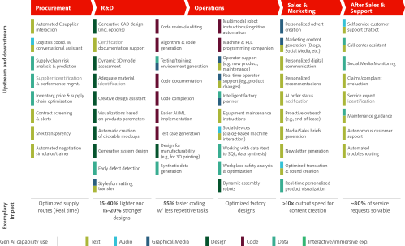{.absolute width=80% left=10% top=15%}

:::

::: {.fragment .fade-in fragment-index=1}

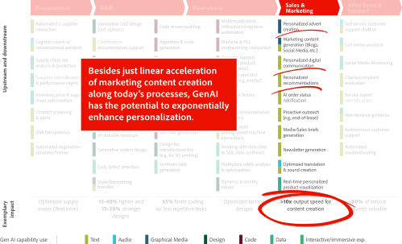{.absolute width=80% left=10% top=15%}

:::

## Unlocking Creativity throughout the entire Marketing Organization - From planning and insight generation to delivery and measurement

```{=html}
<div class="no-height">&nbsp;</div>
```

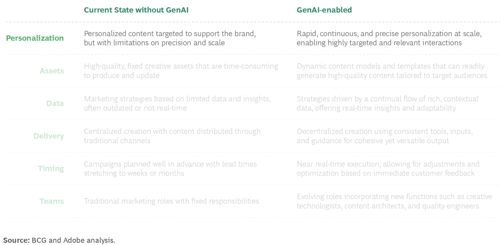{width=95% fig-align="center" style="filter: drop-shadow(5px 5px 5px #222); -webkit-filter: drop-shadow(5px 5px 5px #222);"}


## How GenAI Is Shaping the Future of Creativity in Marketing

```{=html}
<div class="no-height">&nbsp;</div>
```

:::: {layout="[[1,1], [1]]"}

::: {.layout-left .canvas}
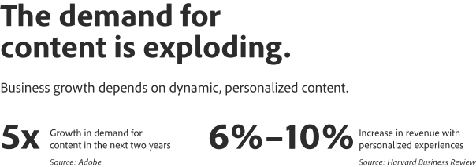{fig-align="center"}
:::

::: {.layout-right style="background: linear-gradient(130deg, rgba(255,255,255,0.6), transparent); border-radius: 20px; border: solid 2px #fff; text-align: center; padding: 1em 0 1em 0"}
<video playsinline="" autoplay="" muted="" loop="" data-video-source="https://www.adobe.com/creativecloud/media_1064405fb991b77d7d8d46838414ea2cb82f6dc26.mp4">
<source src="https://www.adobe.com/creativecloud/media_1064405fb991b77d7d8d46838414ea2cb82f6dc26.mp4" type="video/mp4" />
Your browser does not support the video tag.
</video>
:::

::: {.canvas}
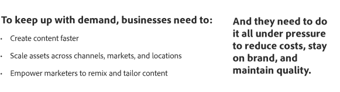{width=75% fig-align="center"}
:::
::::

:::: {.fragment}
::: {.absolute .shadow top="3em" right="-100%"}
{width=40%}
:::

::: {.absolute .shadow top="12.5em" right="-60%"}
{width=50%}
:::
::::


## Can your teams keep up?

```{=html}
<div class="no-height">&nbsp;</div>
```

:::: {layout="[[1], [1,1]]"}

::: {.canvas}
{width=80% fig-align="center"}
:::


:::: {.fragment fragment-index=1}

::: {.canvas}
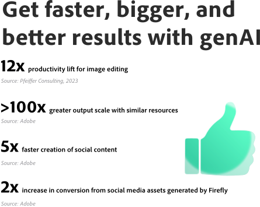{width=80% fig-align="center"}
:::

::::

:::: {.fragment fragment-index=1}

::: {.canvas}
{width=92% fig-align="center"}
:::

::::

::::

::: {.absolute top="8.5em" right="0%"}
{width=100%}
:::


# Adobe Firefly Services {data-stack-name="Solutions"}

Streamline production of asset variants for faster, personalized marketing.

## Explore new ways to create (1/2)

```{=html}
<div class="no-height">&nbsp;</div>
```

:::: {layout="[[1,1], [1,1]]"}

::: {.canvas2 .flex-66}

<span class="text-1">TEXT AND IMAGE TO VIDEO</span>

<span class="text-2">Video workflows, reinvented.</span>

<span class="text-3">Pick two still images and use them as keyframes to generate a video. Or put your idea into motion with a text prompt. Generate b-roll, create visual effects, and refine shots by choosing camera angles, motion, and style.</span>

:::

::: {style="background: linear-gradient(130deg, rgba(255,255,255,0.6), transparent); border-radius: 20px; border: solid 2px #fff; text-align: center; padding: 1em 0 1em 0"}
<video playsinline="" autoplay="" muted="" loop="" data-video-source="https://www.adobe.com/creativecloud/media_18a36150a537ca6d1cfbc19e4bb77ef7db26599d5.mp4">
<source src="https://www.adobe.com/creativecloud/media_18a36150a537ca6d1cfbc19e4bb77ef7db26599d5.mp4" type="video/mp4" />
Your browser does not support the video tag.
</video>
:::

::: {.flex-45 .shadow}

:::

::: {.canvas2 .flex-66}
<span class="text-1">AUDIO AND VIDEO TRANSLATION</span>

<span class="text-2">Go global. Sound local.</span>

<span class="text-3">Make anyone sound like a native speaker by maintaining the same voice, tone, and cadence across multiple languages.</span>
:::

::::

## Explore new ways to create (2/2)

```{=html}
<div class="no-height">&nbsp;</div>
```

:::: {layout="[[1,1], [1,1]], [1,1]]"}

::: {.canvas2 .flex-66}

<span class="text-1">STYLE AND STRUCTURE REFERENCE</span>

<span class="text-2">Create with more precision.</span>

<span class="text-3">Get the right look in less time, even without the perfect prompt. Mimic layouts, poses, and styles. Adjust and refine, or try a new reference image to explore more creative options.</span>

:::

::: {.flex-45 .layout-center .shadow}

:::

::: {.flex-45 .layout-center .shadow}

:::

::: {.canvas2 .flex-66}
<span class="text-1">SCENE TO IMAGE</span>

<span class="text-2">Put your images into perspective.</span>

<span class="text-3">Design dimensional brand graphics, packaging, illustrations, and more in an intuitive 3D workspace. Create accurate spatial relationships, change angles, and adjust lighting fast — no redrawing needed.</span>
:::

::: {.canvas2 .flex-66}

<span class="text-1">CUSTOM MODELS</span>

<span class="text-2">Train on your own brand assets with Custom Models.</span>

<span class="text-3">Drive on-brand content creation across your organization with custom models integrated into your Adobe solutions, unleashing your teams’ creativity while consistently maintaining your unique look and feel.</span>

:::

::: {.flex-45 .layout-center .shadow}

:::

::::

## More assets, less effort, better results: Streamline production of asset variants for faster, personalized marketing (1/2)

```{=html}
<div class="no-height">&nbsp;</div>
```

:::: {layout="[[1,1], [1,1]]"}

::: {.flex-45 .layout-center .shadow}

:::

::: {.canvas2 .flex-66}

<span class="text-1">Campaign refreshes</span>

<span class="text-2">Accelerate campaign refreshes by streamlining repetitive tasks.</span>

<p class="text-3">Quickly produce mass quantities of asset variants and keep marketing up to date — without overburdening your creative team.</p>
<ul class="text-3">
<li>Easily resize assets for any channel or platform.</li>
<li>Quickly update seasonal campaigns with Firefly-generated imagery.</li>
<li>Scale on-brand content quickly with <a href="/products/firefly-business/custom-models.html" daa-ll="Custom Model APIs-1--Accelerate campaign ">Custom Model APIs</a>.</li>
</ul>

:::

::: {.canvas2-margin .flex-66 style="margin-top: 1em;"}

<span class="text-1">Content localization</span>

<span class="text-2">Localize assets and videos to increase marketing reach.</span>

<p class="text-3">Go global with fast, easy-to-use localization that scales.</p>
<ul class="text-3">
<li>Save time and effort using AI-generated location backgrounds instead of creating local variants from scratch.</li>
<li>Streamline content assembly workflows by automating time-consuming, repetitive tasks.</li>
<li>Reduce production costs with Translate and Lip Sync APIs to convert videos into multiple languages.</li>
</ul>

:::

::: {.flex-45 .shadow .layout-center}

:::

::::


## More assets, less effort, better results: Streamline production of asset variants for faster, personalized marketing (2/2)

```{=html}
<div class="no-height">&nbsp;</div>
```

:::: {layout="[[1,1], [1,1]]"}

::: {.flex-45 .layout-center .canvas3}

:::

::: {.canvas2 .flex-66}

<span class="text-1">Content personalization / hyper-personalization</span>

<span class="text-2">Personalize assets and videos to connect with customers.</span>

<p class="text-3">Create unlimited asset variations that tailor your content to diverse audience segments—breaking past resource limits so you can captivate like never before.</p>
<ul class="text-3">
<li>Generate Firefly assets variations without overwhelming your creative teams.</li>
<li>Incorporate segment- specific messages with relevant images into Photoshop templates to personalize ads at scale.</li>
<li>Generate and test more assets to enhance campaign performance.</li>
</ul>

:::

::: {.canvas2-margin .flex-66}

<span class="text-1">AI-driven experiences</span>

<span class="text-2">Create unique user experiences to wow customers.</span>

<p class="text-3">Encourage brand interaction through personalized content, powered by AI.</p>
<ul class="text-3">
<li>Increase engagement by building individual, customized experiences.</li>
<li>Keep content on-brand in every interaction with Custom Models APIs.</li>
<li>Enhance customer satisfaction and build greater brand loyalty.</li>
</ul>

:::

::: {.flex-45 .layout-center .canvas4}

:::

::::

::: {.absolute top="9em" right="-5%"}
{width=100%}
:::


## Key Take Aways: The Impact of Generative AI on Content Creation

<style>
.summary-size {
font-size: 0.7em;
margin: 0 2em 0 2em !important;
font-style: italic;
}
</style>

```{=html}
<div class="no-height">&nbsp;</div>
```
1A. **Efficiency and Speed** - Accelerate processes to unlock capacity

<p class="summary-size">Generative AI can create content much faster than humans can. This speed allows marketers to focus more on strategy and creativity while letting AI handle repetitive tasks.</p>

1B. **Cost-Effective Content Production** - Drive the marginal cost to near zero

<p class="summary-size">Instead of needing large teams of content creators, businesses can use AI to generate high-quality content at a lower cost.</p>

<hr>

2A. **Personalization at Scale as standard** - Connect more deeply with customers

<p class="summary-size">Producing high-quality content at low marginal cost removes the last barrier to scale. Local teams can modify centrally created assets to fit their needs and quickly incorporate customer feedback, customer preferences, behaviors and demographics to refine content within brand guidelines.</p>

2B. **Enhanced Creativity** - Make creative roles more strategic to drive innovation

<p class="summary-size">By working alongside AI, content creators can push the boundaries of their creativity and produce content that truly stands out in a crowded digital space. Streamlining labor-intensive tasks will allow teams to focus on refining concepts and enhancing brand differentiation, two critical functions that GenAI does not replace. New roles will also emerge, such as creative technologists, quality engineers and dedicated security teams.</p>

# Content Supply Chain {data-stack-name="Content SC"}

Transform your content supply chain into a growth engine for personalized experiences

## Start building or maturing your content supply chain with these five critical capabilities

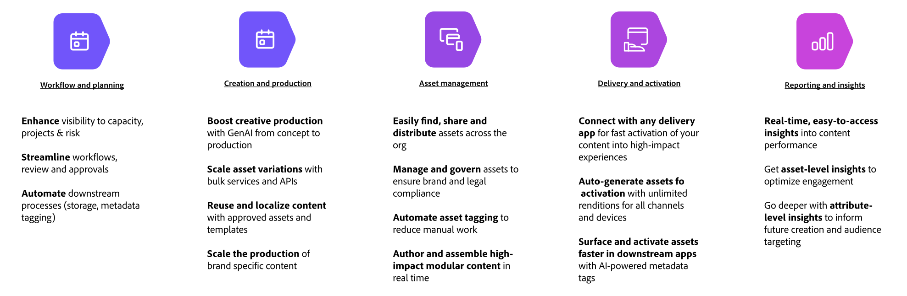{fig-align="center" style="padding-top: 1em;"}


::: {.absolute .shadow top="12em" right="-85%"}
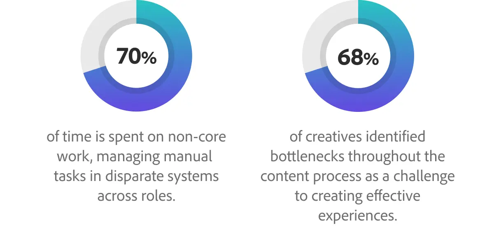{width=30%}
:::


## Stakeholder Engagement: How to power your content supply chain with an integrated solution

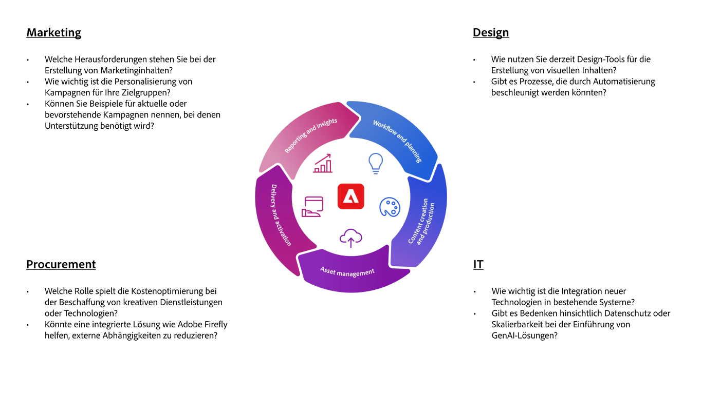{fig-align="center" style="padding-top: 1em;"}

# Next Steps {data-stack-name="Next"}

## Ready to get started?

1.	Follow-up workshop to dive deeper into specific use cases identified during the discussion
2.	Pilot project using Adobe tools like Firefly or GenStudio to demonstrate tangible benefits
3.	Access to sample datasets or campaign briefs to prepare a tailored proof of concept
4.	Connect with Adobe experts to discuss your specific needs and how we can help

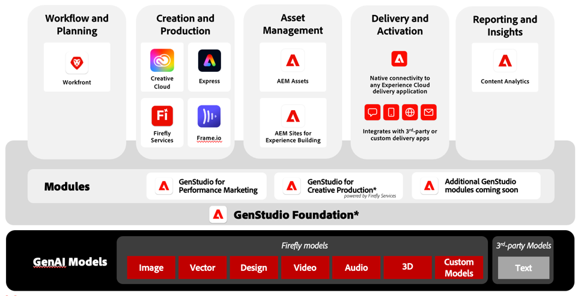{fig-align="center" style="filter: drop-shadow(5px 5px 5px #222); -webkit-filter: drop-shadow(5px 5px 5px #222);"}


# Backup

## The power of generative AI

